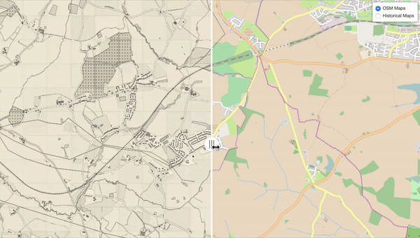

# Generate synthetic historical maps from OSM map tiles

This is the code repo for paper ["Synthetic Map Generation to Provide Unlimited Training Data
for Historical Map Text Detection"](https://zekun-li.github.io/files/GEOAI_2021.pdf) We use cycle-GAN to convert open street map (OSM) images into historical map style. The historical map dataset used for training is downloaded from National Library of Scotland ([NLS](https://maps.nls.uk/)) website. 

- For training, run cycleGAN-keras.py
- For generating synthetic historical maps with trained model, run sytle_convert.py

## Live Demo
A live demo is available at https://zekun-li.github.io/side-by-side/

This demo provides two radio buttons to toggle between two views. The first view compares the synthesized historical map with the input OSM map, and the second view compares the synthesize map with authentic historical maps.




## Pretrained Weights
Weight files can be downloaded [here](https://drive.google.com/drive/folders/1f7P6cUASkBoBte0UJnUPwVoU2QR2Pinu?usp=sharing)

## Generated Synthetic Historical Map Tiles
Synthetic historical map tiles of size 256x256 can be downloaded from Google Drive at [here](https://drive.google.com/file/d/1gFkFsvewoRFRIpGzEYfAXk3Q-ip6bevf/view?usp=sharing)(1.2G), and map tiles of size 728x728 can be downloaded from [here](https://drive.google.com/file/d/1XDm9qZEI-a8OWOPKkpjZx13JdJQJlv5-/view?usp=sharing) (3.5G)


## Citation
```
@inproceedings{li2021synthetic,
  title={Synthetic Map Generation to Provide Unlimited Training Data for Historical Map Text Detection},
  author={Li, Zekun and Guan, Runyu and Yu, Qianmu and Chiang, Yao-Yi and Knoblock, Craig A},
  booktitle={Proceedings of the 4th ACM SIGSPATIAL International Workshop on AI for Geographic Knowledge Discovery},
  pages={17--26},
  year={2021}
}
```

*Ackowlegment*:
The code is adapted from [this](https://github.com/tjwei/GANotebooks/blob/master/CycleGAN-keras.ipynb) github repo.
